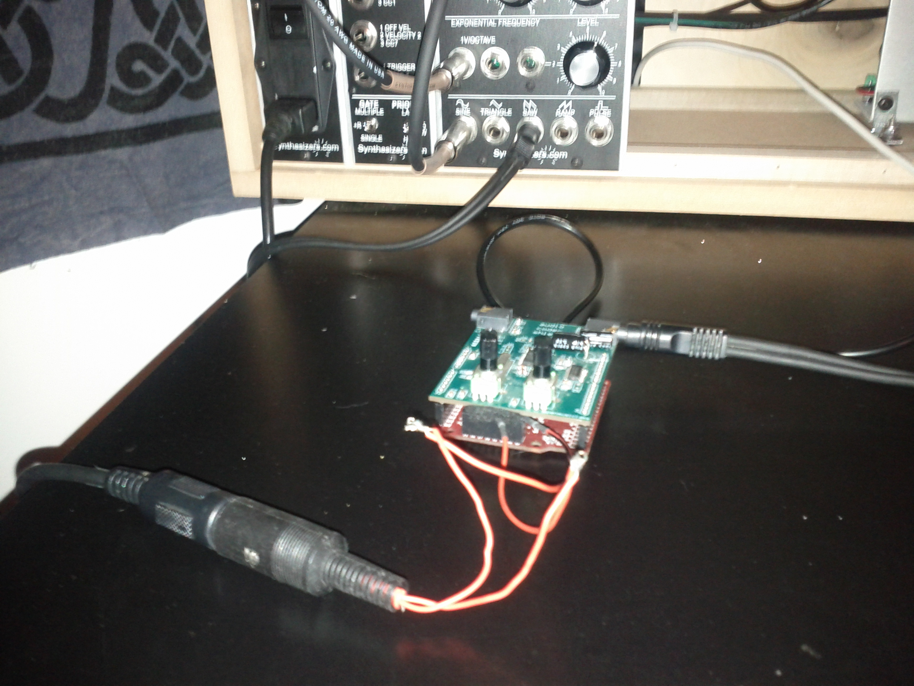

# ARM Polyphonic Wavetable Synth with Hardware MIDI

This is a wavetable Synth Running on a 72Mhz STM32F 32-bit ARM Cortex M3 microprocessor

Here you can see it running, attached to my modular.  It is able to read MIDI 
directly over a serial connection, shown attached to the board, and output via 1/8"
audio jack.

 "ARM polyphonic Wavetable Synth"

This project is using the Leaf Labs Maple board, in combination with Open Music Lab's 
Audio Codec Shield.

* http://leaflabs.com/docs/hardware/maple.html
* http://www.openmusiclabs.com/projects/codec-shield/

Normally this board would be used to create simple stomp boxes for guitar as the board
only features 128KB Flash for storage, and 20KB SRAM, however I have created an 8 voice
polyphonic wavetable synthesizer out of mine :)  The anti-aliased wavetables sine, square,
and sawtooth are precalculated at build time and stored in the Flash Memory.  It is using
mipmapped wavetables, one is generated per octave.

This STM32F is only 72Mhz, so the core wavetable code is pretty optimized, the Cortex M3 
does not feature a floating point unit, so all calculations are done in fixed point.

There is a simple one-pole lowpass filter implemented, which can take MIDI CC input, or
read input from the potentiometers on the audio codec board.
